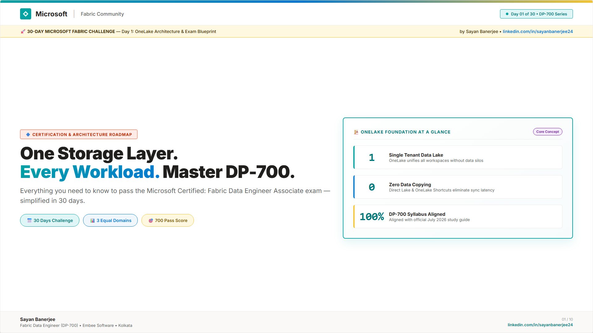
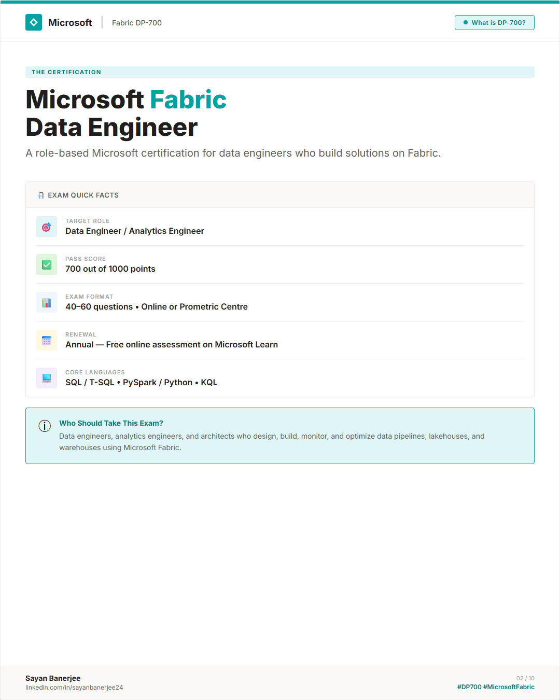
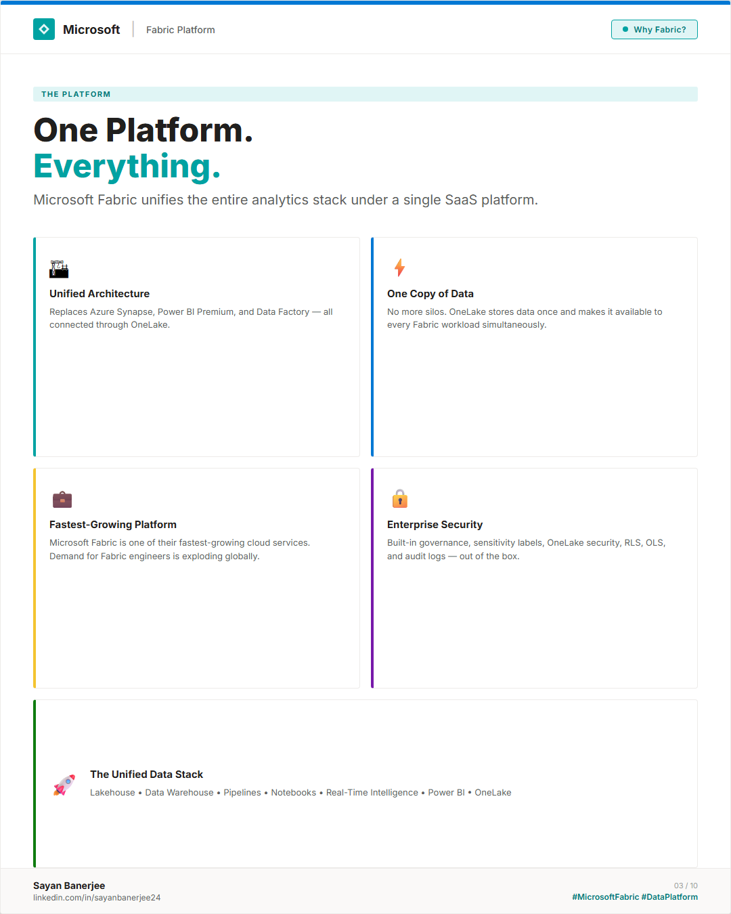
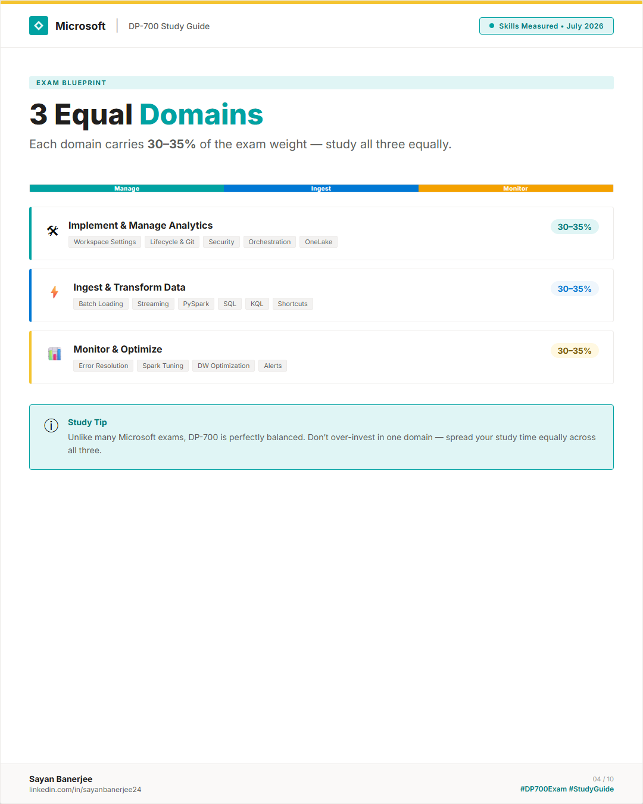
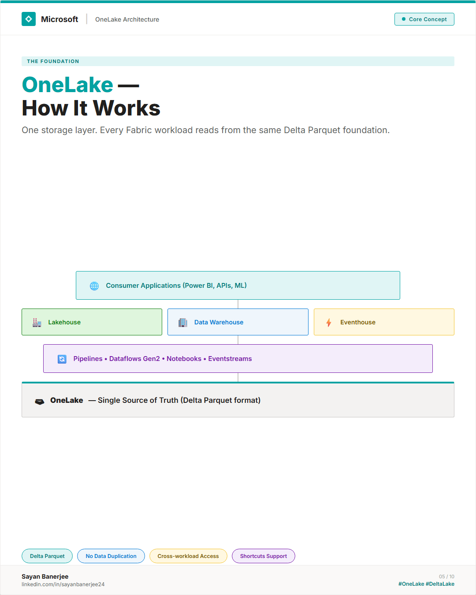
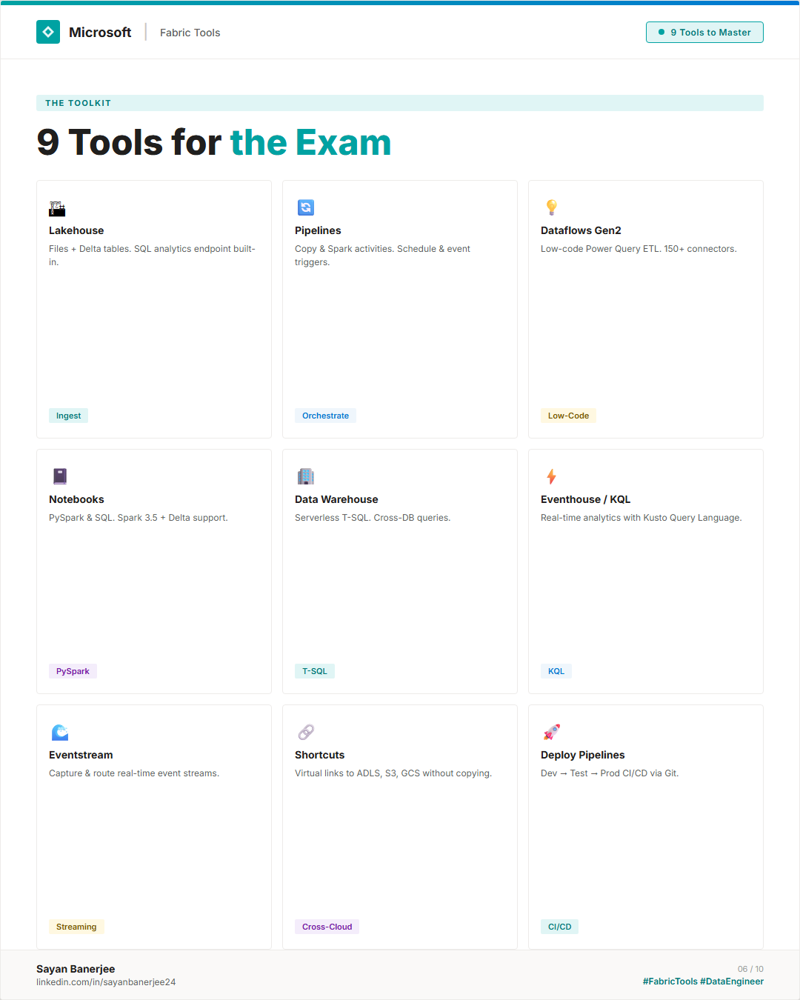
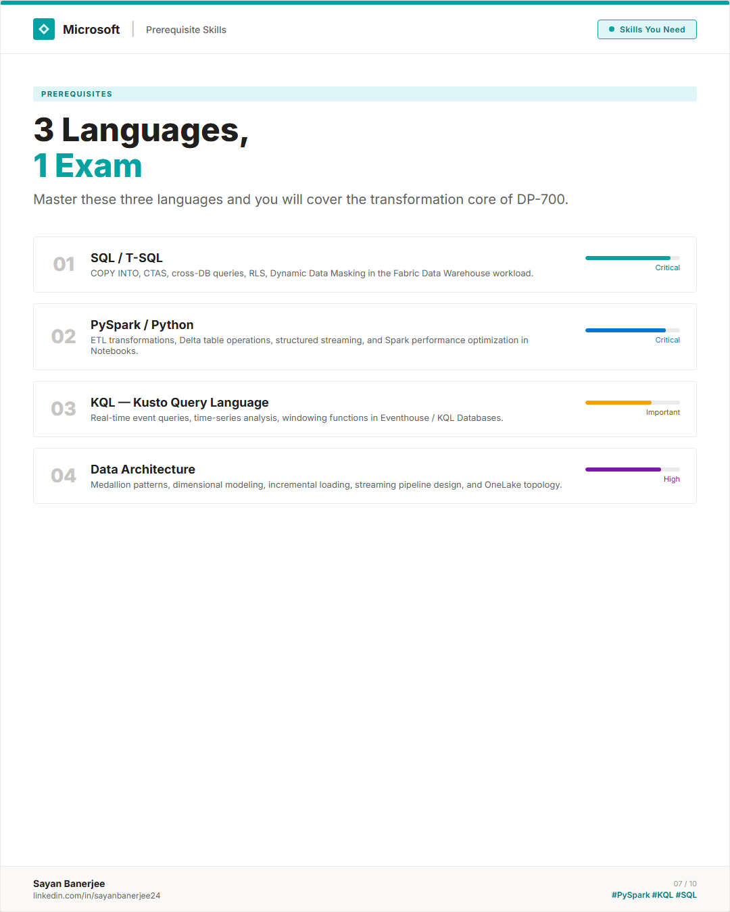
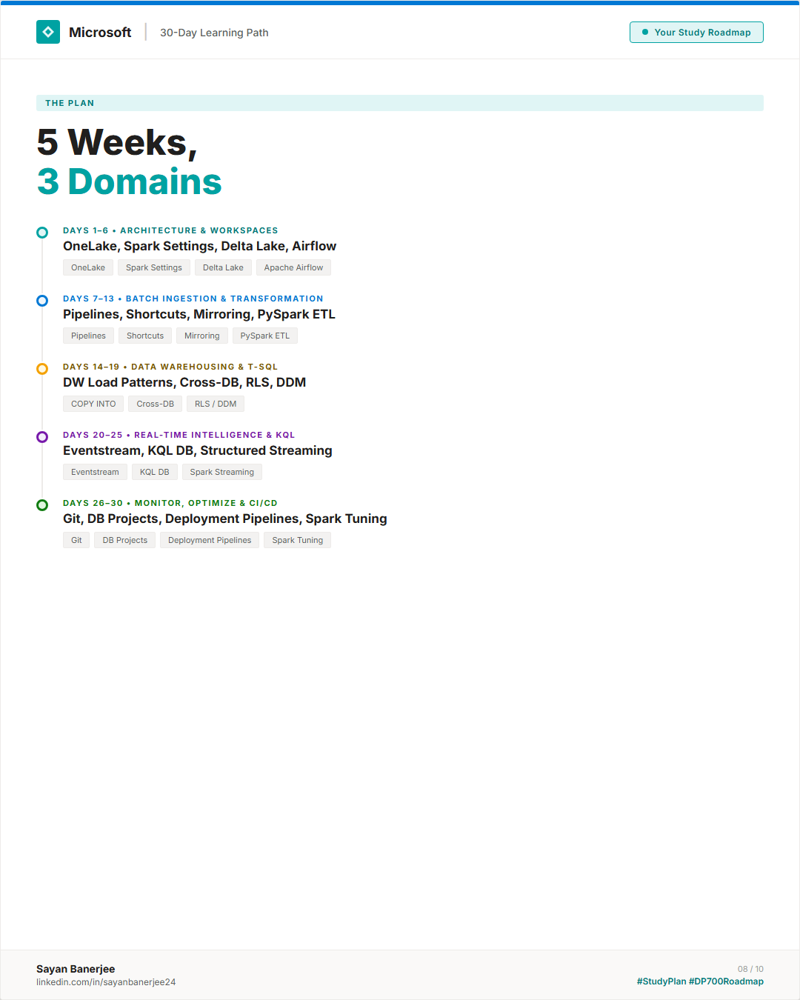
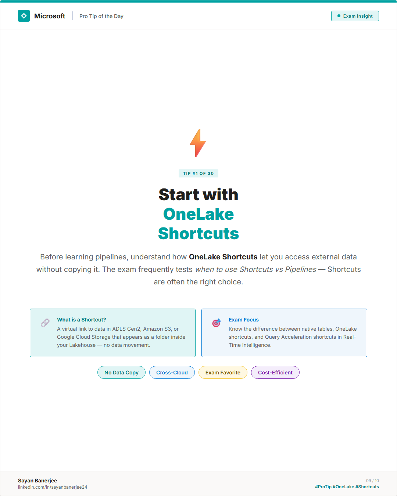
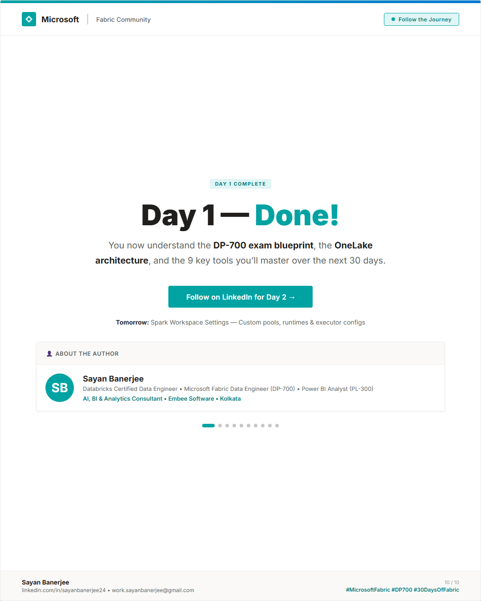

# 📅 Day 01 — OneLake Architecture & Exam Blueprint

This folder contains the complete resources for Day 01 of the DP-700 Microsoft Fabric Data Engineering 30-Day Challenge.

---

## 🖼️ Carousel Slides Preview

These slides are designed in the official Microsoft Fabric Community style. 

*Click on any slide to view the high-resolution version.*

*Slide 1 — Cover & Introduction*

*Slide 2 — Exam Facts*

*Slide 3 — Platform Value Proposition*

*Slide 4 — Skills Measured Weight*

*Slide 5 — OneLake Storage Layout*

*Slide 6 — Fabric Core Tools*

*Slide 7 — SQL, PySpark, KQL*

*Slide 8 — Learning Timeline*

*Slide 9 — Ingestion Best Practices*

*Slide 10 — Call to Action & About the Author*

---

## 📝 Study Notes & Highlights

### 1. OneLake: The Single Source of Truth
*   **Delta Parquet Format:** Every item in OneLake (Lakehouse, Data Warehouse) stores its tabular data in the open-source Delta Parquet format.
*   **Single Copy, Multiple Computes:** Power BI, SQL engines, and Spark notebooks can query the exact same files without moving or copying data.
*   **SaaS Integration:** Similar to how Office 365 integrates files through OneDrive, Microsoft Fabric integrates all analytics data through OneLake.

### 2. The 3 DP-700 Exam Domains
*   **Implement and Manage (30-35%):** Focuses on configuring tenant settings, workspace management, security (RLS, OLS, DDM), Git integration, and deployment pipelines.
*   **Ingest and Transform (30-35%):** Focuses on ingestion options (Shortcuts, Mirroring, Pipelines) and transformation engines (Notebooks, Dataflows Gen2, KQL).
*   **Monitor and Optimize (30-35%):** Focuses on Spark performance tuning, Data Warehouse performance, DMVs, and debugging errors.

### 3. Key Tool Selection Strategy (Exam Tip)
*   *Use Shortcuts* when data resides in external clouds (AWS S3, Google Cloud Storage, ADLS Gen2) and you want to query it without copying.
*   *Use Pipelines* for complex orchestration, schedules, or copy activities.
*   *Use Dataflows Gen2* for low-code/no-code visual ETL.
*   *Use Notebooks* for complex PySpark transformations, machine learning preparation, or heavy batch jobs.

---

## 📂 Files in this Folder

*   [carousel.html](carousel.html) — The editable HTML/CSS source code of the slides.
*   [export-slides.js](export-slides.js) — The Playwright script to automate exporting the slides as PNG.
*   [post-copy.md](post-copy.md) — The optimized LinkedIn post copy ready for copying.
*   [slides/](slides/) — Directory containing all 10 exported PNG slide images.
