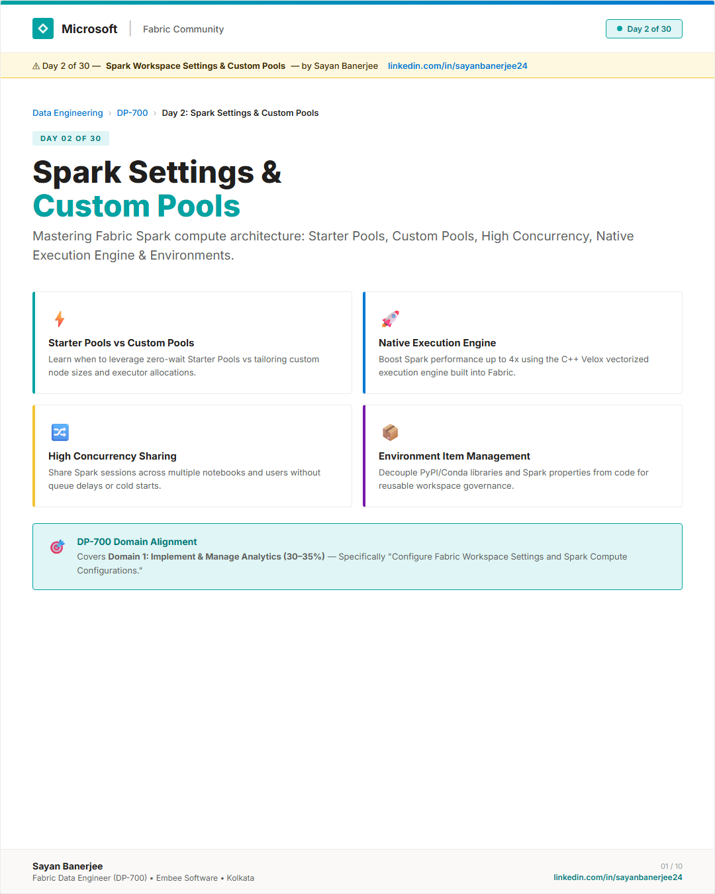
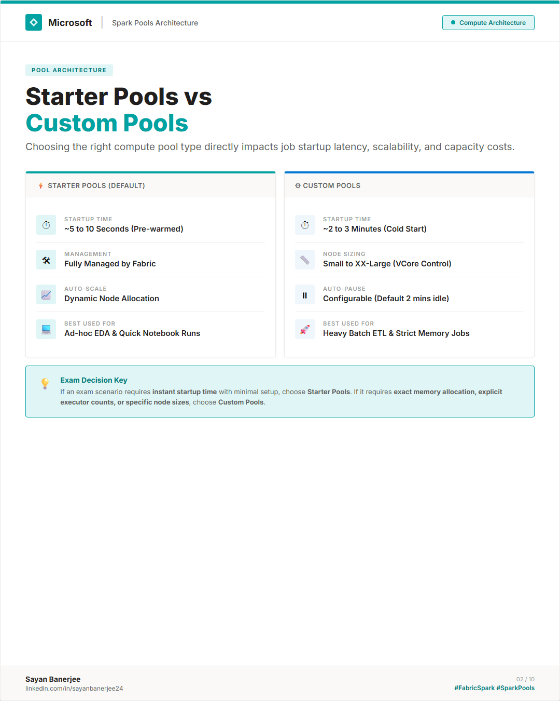
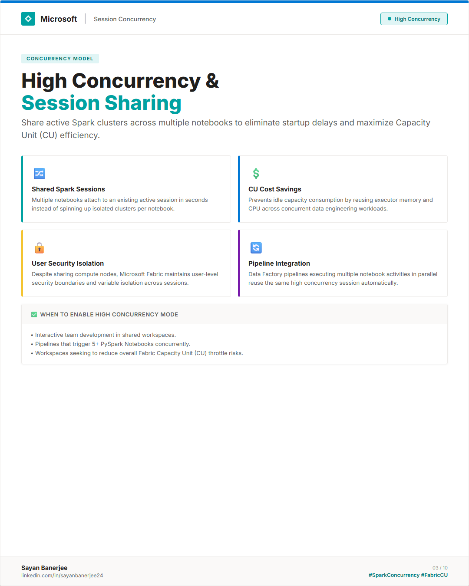
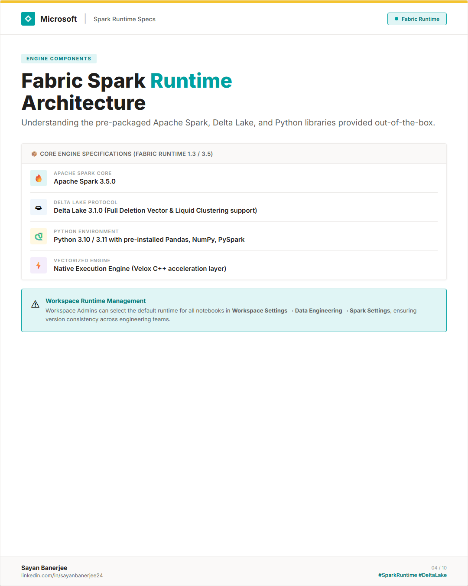
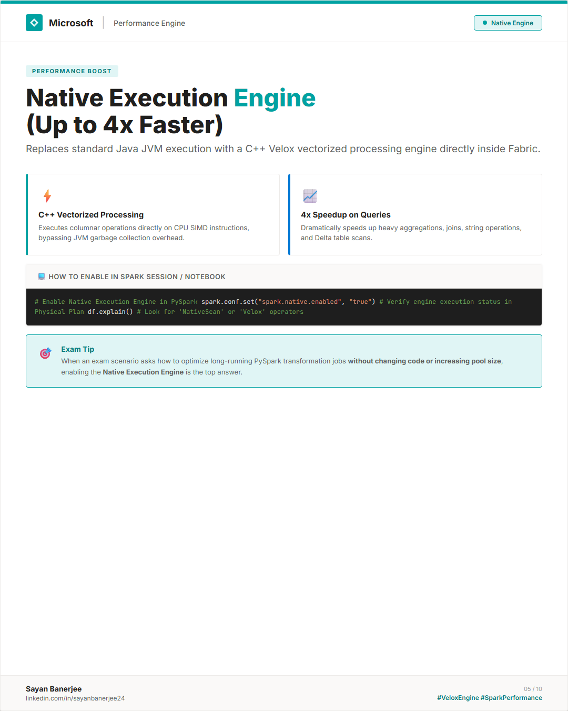
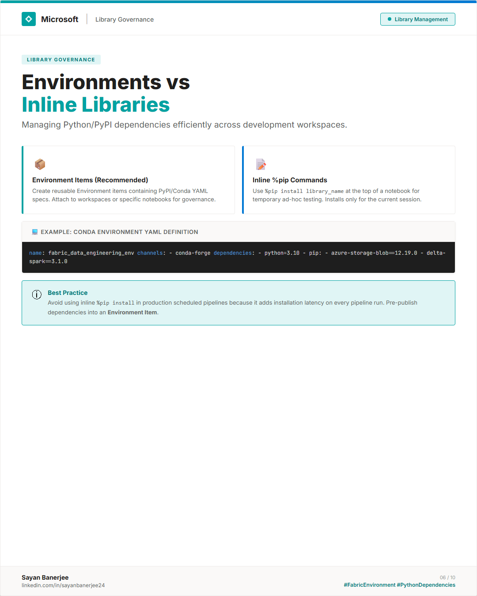
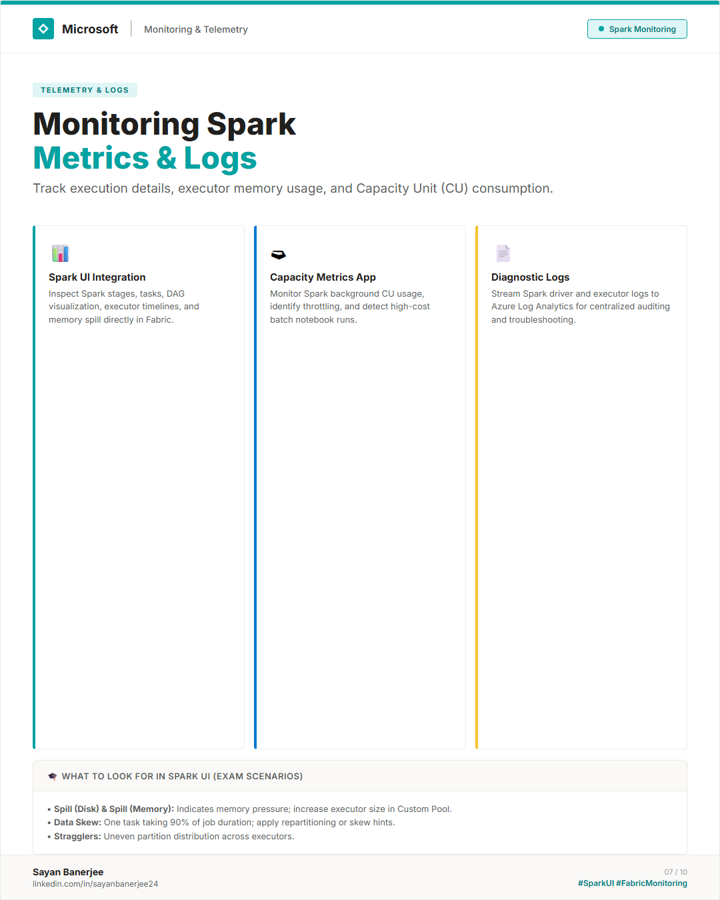
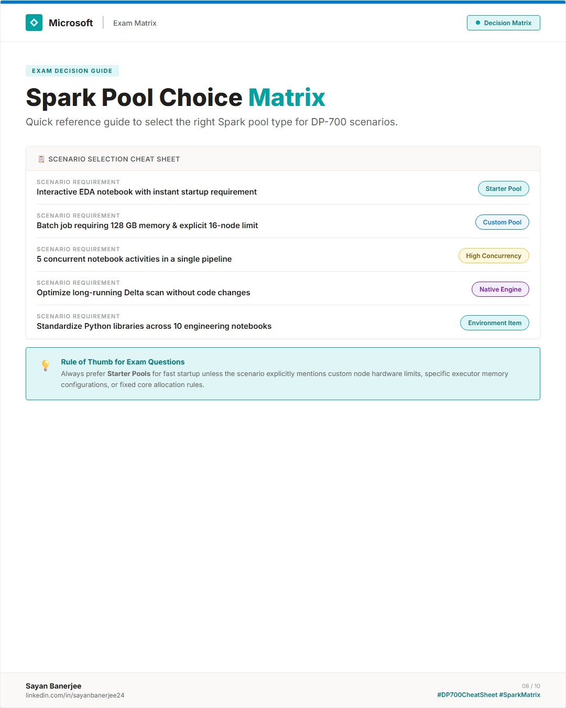
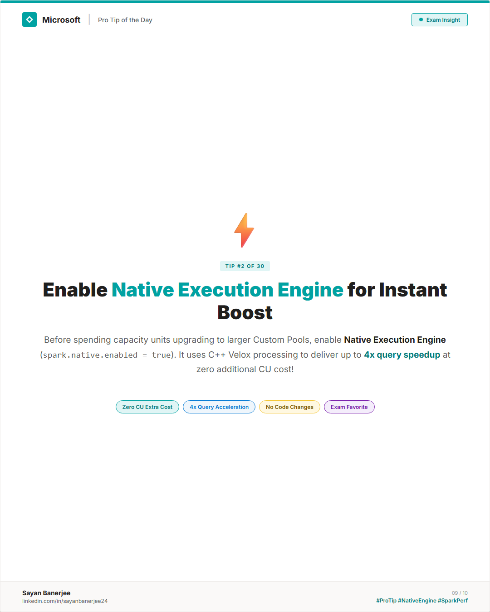
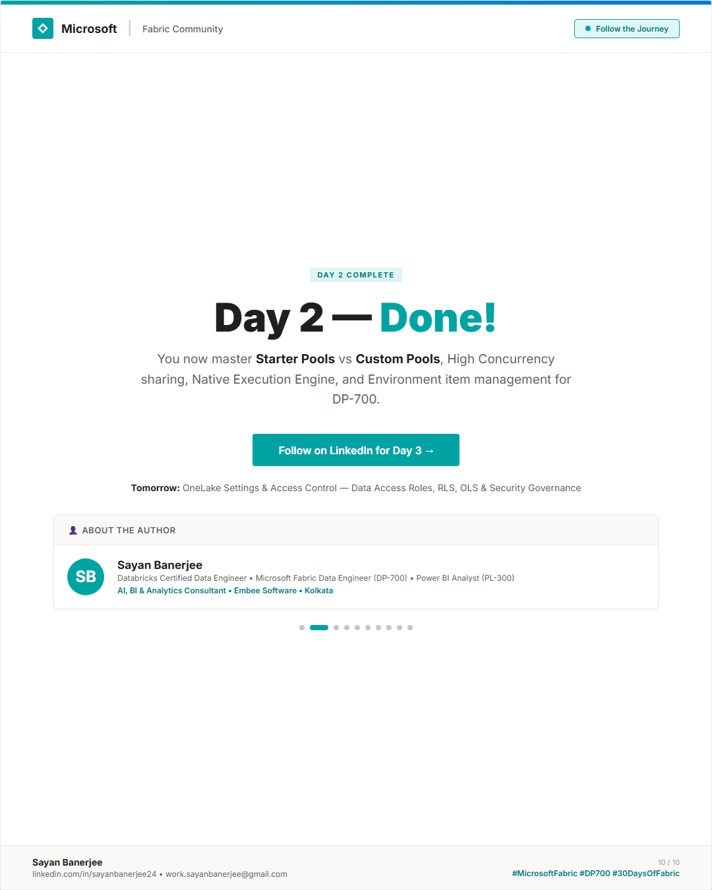

# 📅 Day 02 — Spark Workspace Settings & Custom Pools

This folder contains the complete study materials and resources for Day 02 of the DP-700 Microsoft Fabric Data Engineering 30-Day Challenge.

👉 **[📖 Read Full Day 02 Study Guide & Exam Practice Questions (study-guide.md)](study-guide.md)**

---

## 🖼️ Carousel Slides Preview

These slides are designed in the official Microsoft Fabric Community style. 

*Click on any slide to view the high-resolution version.*

*Slide 1 — Cover & Introduction*

*Slide 2 — Compute Pool Architecture*

*Slide 3 — Session Sharing & CU Optimization*

*Slide 4 — Fabric Runtime (Spark 3.5 & Delta 3.1)*

*Slide 5 — Velox C++ Engine (Up to 4x Speedup)*

*Slide 6 — Environment Items vs Inline %pip*

*Slide 7 — Diagnostic Metrics & Telemetry*

*Slide 8 — Pool Selection Cheat Sheet*

*Slide 9 — Performance Optimization Tip*

*Slide 10 — Call to Action & About the Author*

---

## 📝 Study Notes & Highlights

### 1. Starter Pools vs Custom Pools
*   **Starter Pools:** Instant startup (~5–10s), pre-warmed nodes, fully managed dynamic auto-scaling. Ideal for EDA and quick notebook executions.
*   **Custom Pools:** Cold startup (~2–3m), explicit node family selection (Small to XX-Large), configurable min/max executors and auto-pause timeouts. Ideal for production batch jobs.

### 2. Native Execution Engine (Velox)
*   **Vectorized Processing:** Replaces standard JVM execution with C++ vectorized operations (CPU SIMD instructions).
*   **4x Speedup:** Accelerates heavy joins, aggregations, and Delta table scans without code changes (`spark.native.enabled = true`).

### 3. Library Management Governance
*   **Environment Items:** Centrally manage PyPI/Conda YAML specs across workspaces without pipeline startup penalty.
*   **Inline `%pip`:** Use for ad-hoc testing only; avoid in scheduled pipelines.

---

## 📂 Files in this Folder

*   [study-guide.md](study-guide.md) — Comprehensive Day 02 Study Guide & DP-700 Practice Questions.
*   [carousel.html](carousel.html) — The editable HTML/CSS source code of the slides.
*   [slides/](slides/) — Directory containing all 10 exported PNG slide images.
