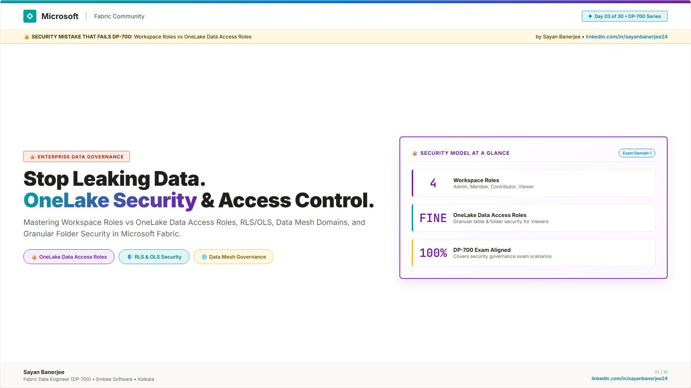
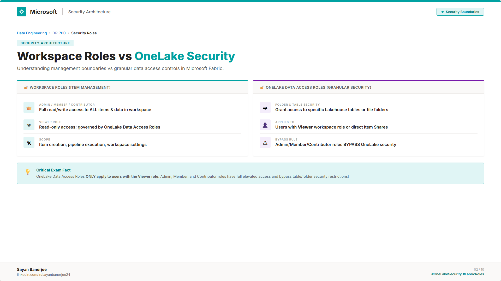
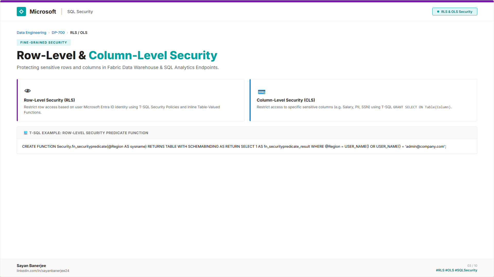
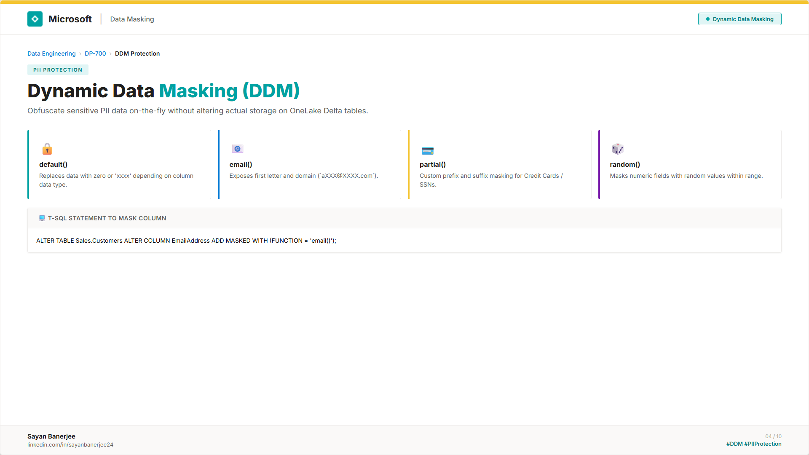
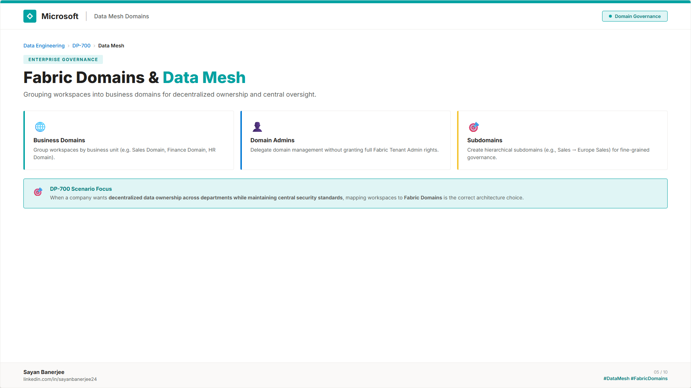
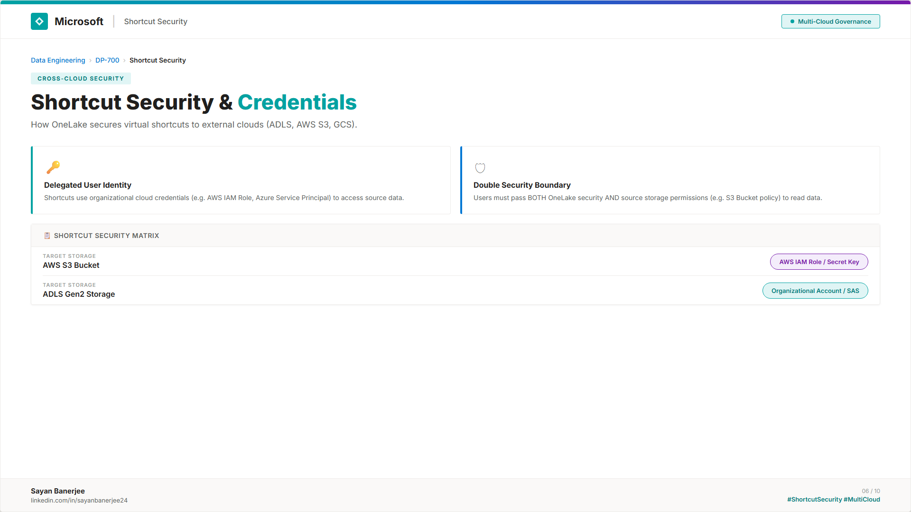
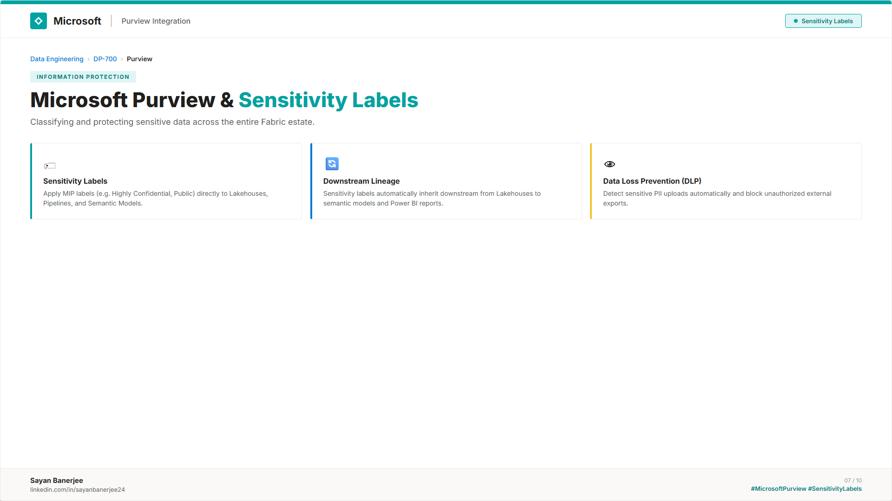
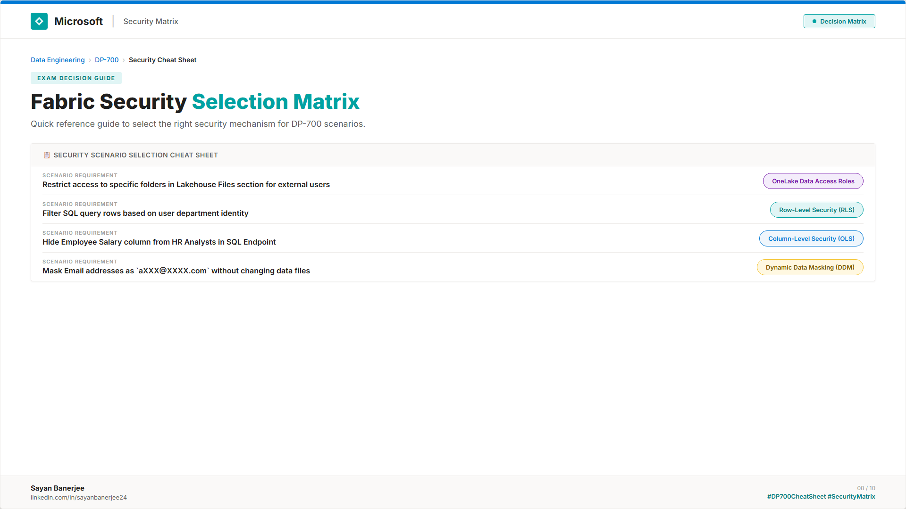
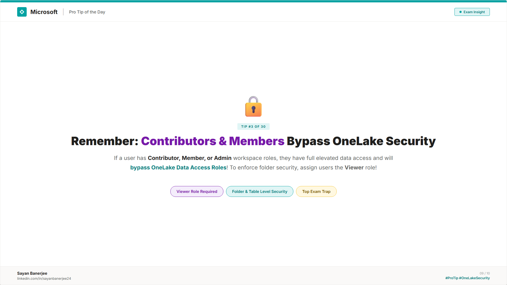
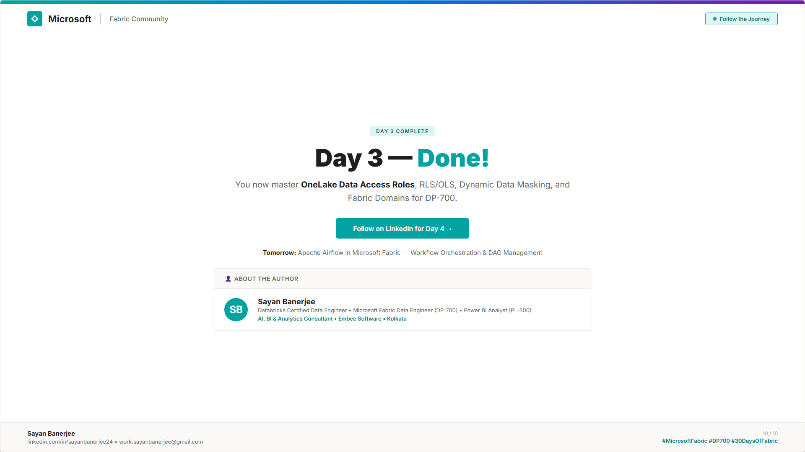

# 📅 Day 03 — OneLake Settings & Access Control

This folder contains the complete study materials and resources for Day 03 of the DP-700 Microsoft Fabric Data Engineering 30-Day Challenge.

👉 **[📖 Read Full Day 03 Study Guide & Practice Questions (study-guide.md)](study-guide.md)**  
👉 **[📢 Read LinkedIn Post Copy & Hashtags (post-copy.md)](post-copy.md)**  
👉 **[🖼️ View Editable Slide Source HTML (carousel.html)](carousel.html)**

---

## 🖼️ Carousel Slides Preview

These slides are designed in the official Microsoft Fabric Community style.

*Click on any slide to view the high-resolution version.*

*Slide 1 — Cover & Introduction*

*Slide 2 — The 3 Layers of Fabric Security Architecture*

*Slide 3 — Admin vs Member vs Contributor vs Viewer*

*Slide 4 — Read, ReadData, Write, Reshare & Execute*

*Slide 5 — Fine-Grained Folder, File & Delta Table Security*

*Slide 6 — User Identity Passthrough vs Delegated Credentials*

*Slide 7 — SQL Endpoint vs Spark RLS/CLS Enforcement*

*Slide 8 — Top 3 DP-700 Security Exam Traps*

*Slide 9 — Security Decision Cheat Sheet*

*Slide 10 — Call to Action & About the Author*

---

## 📝 Study Notes & Highlights

### 1. Workspace Roles vs Item Permissions
*   **Workspace Roles:** Coarse-grained governance — Admin, Member, Contributor, Viewer.
*   **Item Permissions:** Granular item-level access. `ReadData` is **required** alongside `Read` for SQL Endpoint and PySpark table access.

### 2. OneLake Data Access Roles (Preview)
*   Enforces folder, file, and Delta table security **directly inside OneLake**.
*   Applies uniformly across PySpark, SQL Analytics Endpoint, and Power BI DirectLake mode — unlike T-SQL RLS/CLS which only guards the SQL layer.

### 3. OneLake Shortcut Authentication
*   **User Identity Passthrough:** Runtime check against the user's own ADLS/S3 IAM permissions.
*   **Delegated Credentials (Service Principal):** Users need only Fabric permissions; target cloud access handled by stored credential.

---

## 📂 Files in this Folder

*   [study-guide.md](study-guide.md) — Comprehensive Day 03 Study Guide & 3 DP-700 Practice Questions.
*   [post-copy.md](post-copy.md) — Official LinkedIn Post copy and hashtags.
*   [carousel.html](carousel.html) — Editable HTML/CSS source code for all 10 slides.
*   [export-slides.js](export-slides.js) — Playwright script to export slides as high-resolution PNGs.
*   [Day-03-OneLake-Access-Control-Carousel.pdf](Day-03-OneLake-Access-Control-Carousel.pdf) — Combined PDF carousel ready for LinkedIn upload.
*   [slides/](slides/) — Directory containing all 10 exported PNG slide images.
