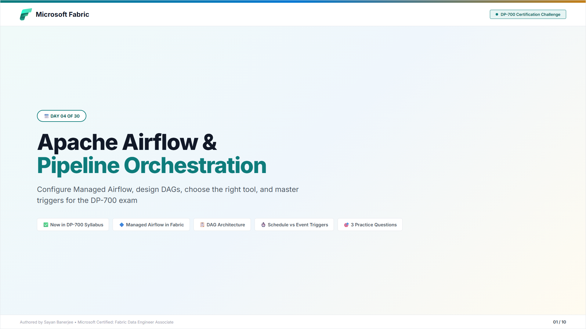
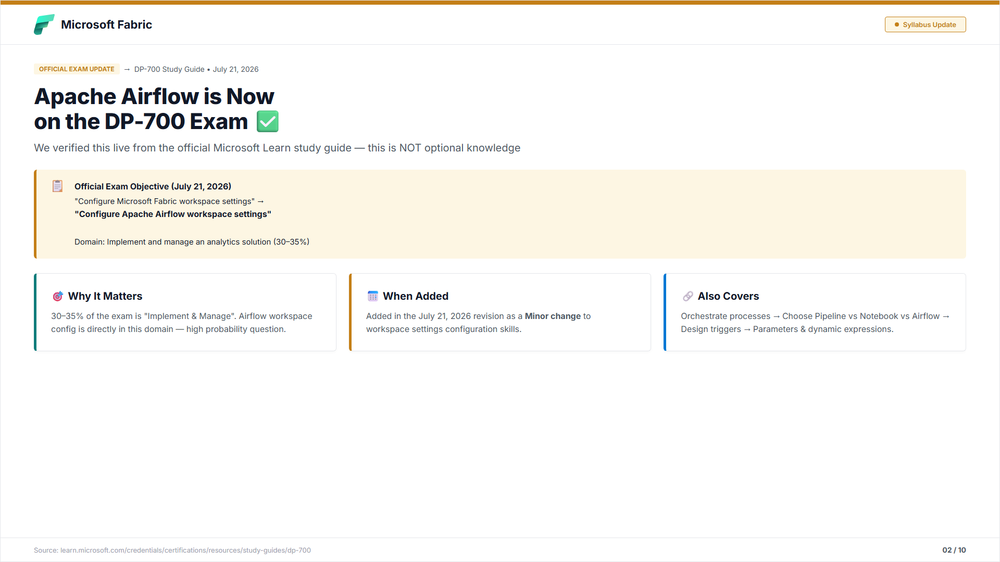
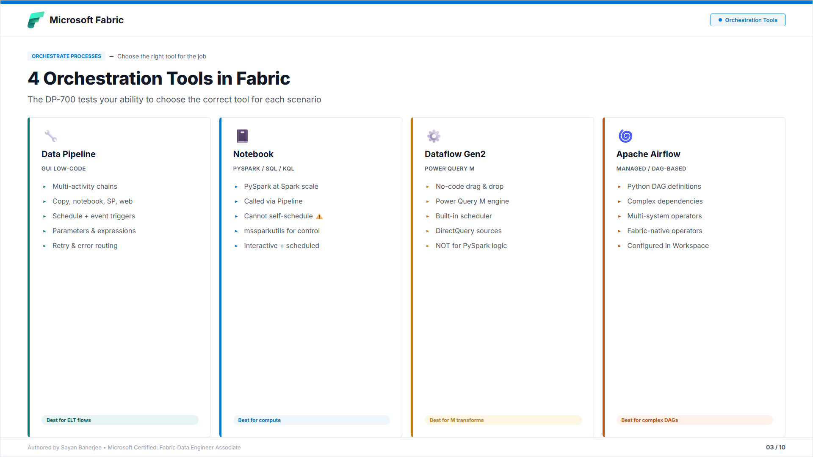
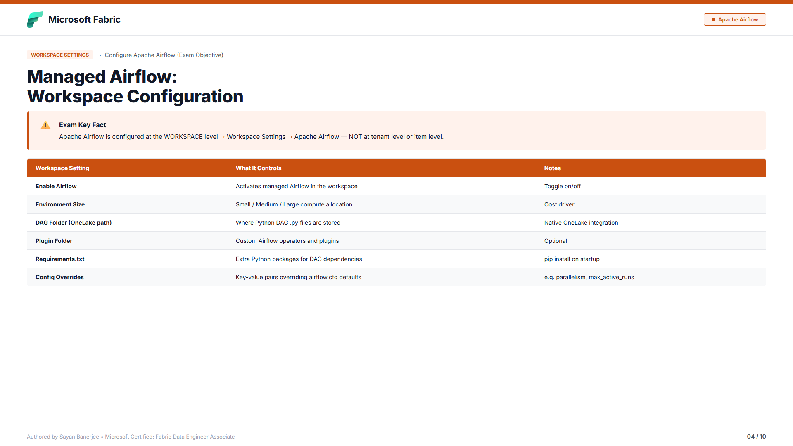
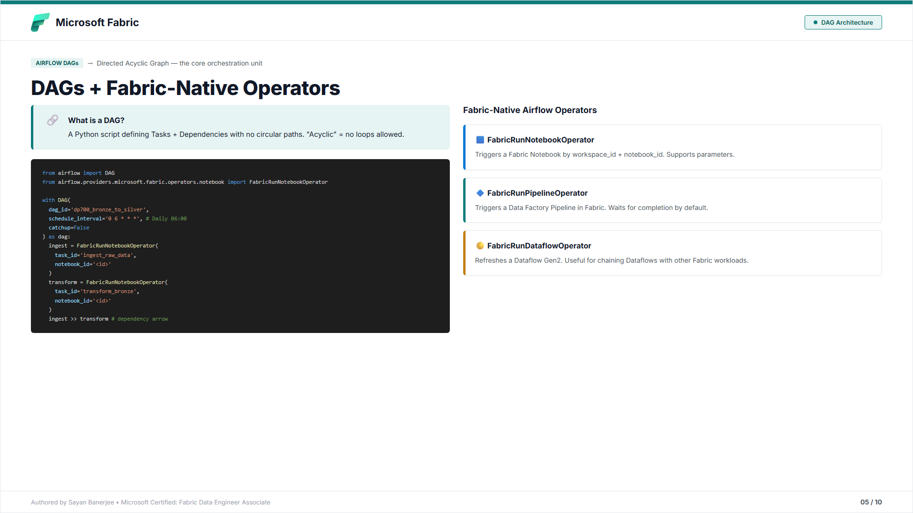
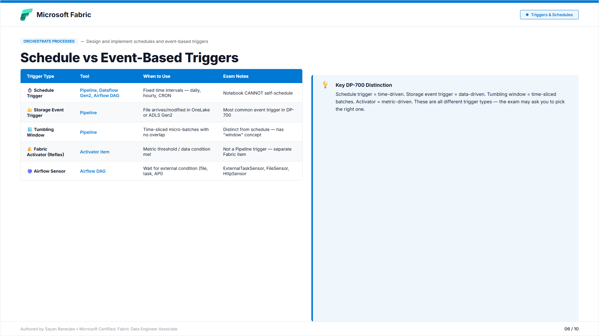
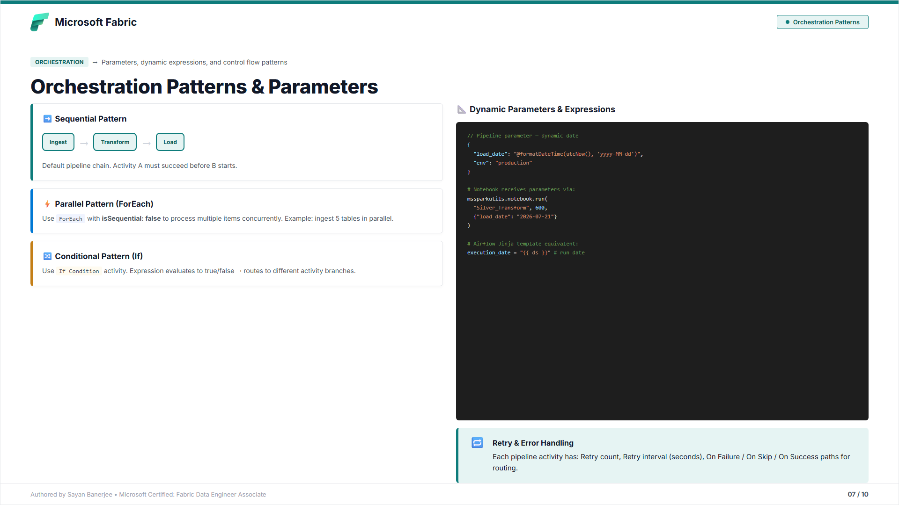
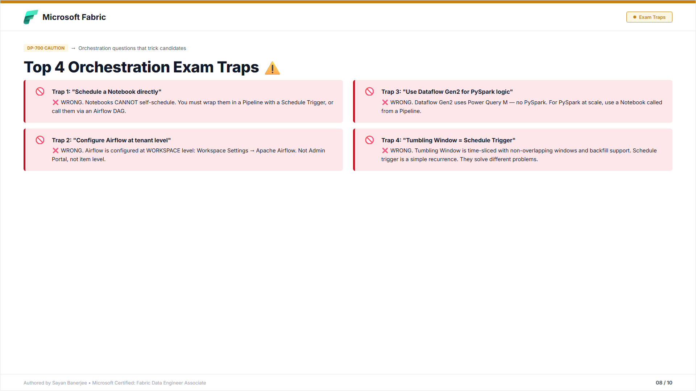
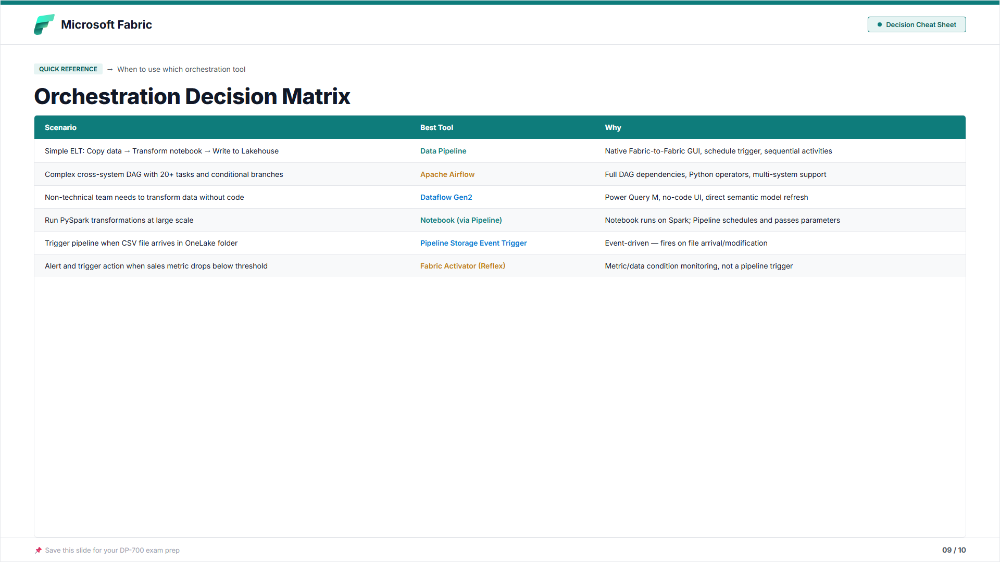
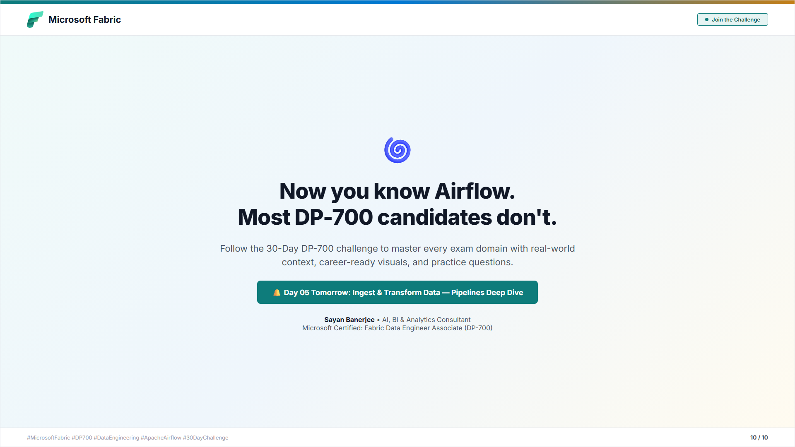

# 📅 Day 04 — Apache Airflow & Pipeline Orchestration in Microsoft Fabric

This folder contains the complete study materials for Day 04 of the DP-700 Microsoft Fabric Data Engineering 30-Day Challenge.

👉 **[📖 Read Full Day 04 Study Guide & Practice Questions (study-guide.md)](study-guide.md)**
👉 **[📢 Read LinkedIn Post Copy & Hashtags (post-copy.md)](post-copy.md)**
👉 **[🖼️ View Editable Slide Source HTML (carousel.html)](carousel.html)**

---

## 🔗 DP-700 Syllabus Alignment

> ✅ **CONFIRMED on Microsoft Learn (July 21, 2026 update):**
> `"Configure Apache Airflow workspace settings"` is explicitly listed under:
> **Implement and manage an analytics solution (30–35%)** → **Configure Microsoft Fabric workspace settings**

Apache Airflow in Fabric is NOT just a "nice to know" — it is a **tested exam objective**.

---

## 🖼️ Carousel Slides Preview

*Slide 1 — Cover: Apache Airflow & Pipeline Orchestration*

*Slide 2 — What is Pipeline Orchestration in Fabric?*

*Slide 3 — Pipeline vs Notebook vs Apache Airflow*

*Slide 4 — Apache Airflow: Workspace Settings & DAGs*

*Slide 5 — Directed Acyclic Graphs (DAGs) Explained*

*Slide 6 — Schedule Triggers vs Event-Based Triggers*

*Slide 7 — Parameters, Dynamic Expressions & Patterns*

*Slide 8 — Top 3 DP-700 Orchestration Exam Traps*

*Slide 9 — When to Use What: Decision Cheat Sheet*

*Slide 10 — Call to Action*

---

## 📂 Files in this Folder

- [study-guide.md](study-guide.md) — Comprehensive study guide + 3 DP-700 practice questions
- [post-copy.md](post-copy.md) — LinkedIn post copy and hashtags
- [carousel.html](carousel.html) — Editable HTML/CSS source for all 10 slides
- [export-slides.js](export-slides.js) — Playwright script to export slides as PNGs
- [Day-04-Airflow-Orchestration-Carousel.pdf](Day-04-Airflow-Orchestration-Carousel.pdf) — LinkedIn-ready PDF
- [slides/](slides/) — All 10 exported PNG slide images
